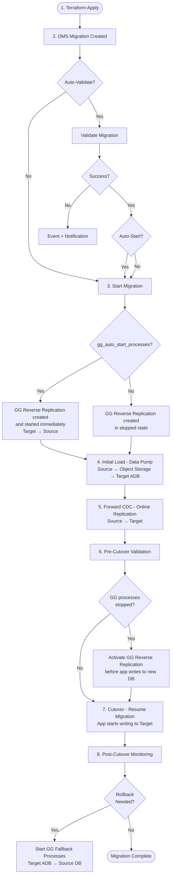

# OCI Database Migration Terraform Package

**Automated Oracle Database Migration from AWS (or On-Premises) to OCI Autonomous Database using Terraform, OCI Database Migration Service (DMS), and OCI GoldenGate.**

---

## Overview

This Terraform package provisions and orchestrates a complete Oracle database migration pipeline using OCI's fully managed services. Define your source databases, target ADBs, and schema lists in `terraform.tfvars` — Terraform handles everything else: networking, secrets, GoldenGate deployment, DMS connections, online replication, monitoring, and notifications.

> **Built-in Migration Fallback**: Every online migration can be deployed with an automatic reverse replication path powered by OCI GoldenGate. If issues arise after cutover, activate the pre-configured GoldenGate Extract and Replicat processes to replicate data back from the target ADB to the source database — providing a proven rollback strategy without manual setup or additional infrastructure.

### What Gets Created

1. **DMS Connections** — source Oracle DB + target ADB with private endpoints and replication credentials
2. **OCI GoldenGate Deployment** — managed deployment with connections assigned for replication and fallback
3. **Online Migrations** — Data Pump initial load via Object Storage + GoldenGate continuous replication (CDC)
4. **Enterprise Monitoring** — two-tier alarms (WARNING + CRITICAL) for lag, CPU, and deployment health
5. **Event Notifications** — OCI Events rules for DMS/GG lifecycle changes → ONS Topic → email/PagerDuty
6. **Vault Secrets** — all credentials stored securely in OCI Vault
7. **Auto-validate and auto-start** — migrations kick off automatically via OCI CLI provisioners
8. **Pre-cutover validation scripts** — generated per migration for safe switchover
9. **Reverse replication (fallback)** — GoldenGate Extract/Replicat processes auto-created via REST API
10. **Operational logging** — optional OCI Logging integration for DMS and GoldenGate
11. **Interactive operations utility** — menu-driven shell script for day-2 operations

### Key Benefits

| Benefit | Detail |
|---------|--------|
| **Zero-cost DMS** | [OCI Database Migration Service is free](https://docs.oracle.com/en-us/iaas/database-migration/doc/overview-database-migration.html) |
| **Fully managed** | No infrastructure to maintain — DMS and GoldenGate are OCI services |
| **Minimal downtime** | Online migration keeps source available during the entire process |
| **Fallback ready** | OCI GoldenGate reverse replication provides a proven rollback path — replicate data back from target to source if issues arise post-cutover |
| **Repeatable** | Terraform IaC = identical deployments across environments |
| **N:M migrations** | Multiple schemas, sources, and targets in a single configuration |
| **Reduced operations** | No manual console clicks — configure variables, run `terraform apply` |
| **Interactive ops** | `migration-utility.sh` provides a menu for all day-2 operations |

---

## Architecture

```
┌──────────────────────────────────────────────────────────────────────────────┐
│                              OCI Tenancy                                     │
│                                                                              │
│  ┌─────────────────────────────────────────────────────────────────────────┐  │
│  │                        Private Subnet (VCN)                             │  │
│  │                                                                         │  │
│  │   ┌────────────┐      ┌──────────────┐      ┌────────────────────┐     │  │
│  │   │  DMS        │      │  GoldenGate  │      │  Autonomous DB     │     │  │
│  │   │  Service    │──────│  Deployment  │──────│  (Target)          │     │  │
│  │   │  (Free)     │      │  (Managed)   │      │  Private Endpoint  │     │  │
│  │   └──────┬──────┘      └──────┬───────┘      └────────────────────┘     │  │
│  │          │      NSG (1521-1522, 443)                                    │  │
│  └──────────┼──────────────────────┼───────────────────────────────────────┘  │
│             │                      │                                          │
│  ┌──────────┴──────────────────────┴───────────────────────────────────────┐  │
│  │  OCI Vault │ OCI Events │ OCI Monitoring │ OCI Logging │ ONS → Email   │  │
│  └─────────────────────────────────────────────────────────────────────────┘  │
└──────────────────────────────┬───────────────────────────────────────────────┘
                               │ VPN / FastConnect / Peering
                      ┌────────┴─────────┐
                      │  Source Oracle DB │
                      │  (AWS / On-Prem)  │
                      └──────────────────┘
```

### Migration Flow

1. `terraform apply` → creates all OCI resources
2. **DMS Validate** → checks connectivity and CPAT compatibility
3. **DMS Start** → Data Pump export → Object Storage → import (Initial Load)
4. **GoldenGate CDC** → continuous replication of changes
5. **Monitor Replication Lag** → DMS pauses for confirmation
6. **Pre-cutover validation** → run generated script
7. **Switchover** → resume DMS to finalize

## Migration and Cutover Flow



---

## Migration Fallback Strategy

One of the most critical concerns in any database migration is **what happens if something goes wrong after cutover**. This package addresses that concern directly by integrating OCI GoldenGate as a **migration fallback mechanism**.

### Why Fallback Matters

Database migrations are inherently high-risk operations. Applications may behave unexpectedly against the new target, performance characteristics may differ, or data integrity issues may surface only under production load. Without a fallback strategy, the only option is to restore from backups — a process that is slow, error-prone, and results in data loss for any transactions that occurred after cutover.

### How It Works

This package provisions a **standalone OCI GoldenGate deployment** alongside the DMS migration pipeline. For any migration with `enable_reverse_replication = true`, Terraform automatically:

1. **Registers both databases** with the GoldenGate deployment (source as `EXT_<key>`, target as `ADB_<key>`)
2. **Creates Extract and Replicat processes** via the GoldenGate REST API, pre-configured with the correct schema mappings derived from the migration's object lists
3. **Generates parameter files** (`gg-config/extract-*.prm`, `gg-config/replicat-*.prm`) with TABLE/MAP rules matching the migrated schemas

By default, these processes are created in a **stopped state** — ready to be activated manually at any point before or after cutover. If `gg_auto_start_processes = true` (or per-migration `auto_start_gg_processes = true`), the processes are created and **started immediately**, so reverse replication is already running before cutover begins.

### When to Activate Fallback

There are two approaches depending on your configuration:

**Option A — Auto-start (`gg_auto_start_processes = true`)**: GoldenGate Extract and Replicat processes start automatically after creation. Reverse replication (Target → Source) is already running when you reach the cutover step. No manual activation needed.

**Option B — Manual activation (`gg_auto_start_processes = false`, default, RECOMMENDED)**: Processes are created in stopped state. Activate them **just before cutover** — i.e., before the application starts writing to the new target DB. Run `gg_activate_fallback.sh` to re-position SCN to the current time and start both processes. This avoids accumulating stale redo logs between Terraform apply and actual cutover:

```bash
# Via migration-utility.sh (Option 11)
./migration-utility.sh

# Or directly via GoldenGate REST API
# The utility handles authentication and process startup automatically
```

### Fallback Configuration

Enable fallback per migration and control when processes start:

```hcl
# Global default: GG fallback processes created in stopped state (RECOMMENDED)
gg_auto_start_processes = false

migrations = {
  hr_migration = {
    display_name              = "HR Schema Migration"
    migration_type            = "ONLINE"
    source_db_key             = "aws_oracle_prod"
    target_db_key             = "adb_prod"
    include_allow_objects      = ["HR.*"]
    enable_reverse_replication = true   # ← enables the fallback path
    auto_start_gg_processes    = true   # ← override: start GG processes immediately
  }
}
```

> **Note**: Fallback requires an ONLINE migration type. The GoldenGate deployment is shared across all migrations — only one deployment is provisioned regardless of how many migrations have fallback enabled.

---

## Security Model

- All database credentials stored in **OCI Vault** as Base64-encoded secrets with master key encryption
- DMS connections use **private endpoints** within the VCN (no public IP)
- GoldenGate deployment runs in **private subnet** with NSG
- NSG rules restrict traffic to Oracle DB ports (1521-1522) and HTTPS (443) from within VCN
- Lifecycle ignores on sensitive fields prevent password diff on plan
- Terraform state contains sensitive data — use remote backend with encryption (S3/HTTP backend examples in `provider.tf`)

## Prerequisites

### Tools

- [Terraform](https://www.terraform.io/downloads) >= 1.5.0
- [OCI CLI](https://docs.oracle.com/en-us/iaas/Content/API/SDKDocs/cliinstall.htm) (for auto-validate/start and migration-utility.sh)
- `jq` (for migration-utility.sh)
- `md5sum` (for GoldenGate process name generation)

### OCI Resources (pre-existing)

- VCN with private subnet and connectivity to source DB
- OCI Vault with Master Encryption Key
- Object Storage Bucket for Data Pump staging
- Autonomous Database (target) with private endpoint
- ONS Notification Topic (optional, for alerts)

### Source and Target Database Preparation

```bash
./scripts/dms-db-prep-v2.sh
```

This configures GGADMIN, supplemental logging, archive log mode, and Data Pump directories. Supports Oracle 11g through 21c, PDB/ADB/RDS sources, and online/offline modes.

You can download the prep script from [Download & Use Database Preparation Utility to Prepare Your Databases for Migration](https://support.oracle.com/support/?anchorId=&kmContentId=2953866&page=sptemplate&sptemplate=km-article)
> **Reference**: [Preparing an Oracle Source Database](https://docs.oracle.com/en-us/iaas/database-migration/doc/preparing-oracle-source-database.html)

---

## Quick Start

```bash
# 1. Clone and configure
git clone https://github.com/Diegoecab/oci-db-migrations.git
cd oci-db-migrations
cp terraform.tfvars.example terraform.tfvars
# Edit terraform.tfvars with your OCIDs, credentials, and schema definitions

# 2. Deploy
terraform init
terraform plan
terraform apply

# 3. Monitor (OCI CLI)
oci database-migration migration get \
  --migration-id <MIGRATION_OCID> \
  --query 'data.{state:"lifecycle-state",type:type}' --output table

# 4. Pre-cutover validation
./gg-config/pre-cutover-<migration_key>.sh

# 5. Switchover
oci database-migration migration resume --migration-id <MIGRATION_OCID>
```

---

## Configuration

### Source Databases

Define one or more source Oracle databases in the `source_databases` map:

```hcl
source_databases = {
  aws_oracle_prod = {
    display_name = "AWS Oracle Production"
    host         = "10.0.1.100"
    hostname     = "oracle-prod.internal"
    port         = 1521
    service_name = "ORCL"
    username     = "dms_admin"
    password     = "your-secure-password"
    gg_username  = "GGADMIN"
    gg_password  = "your-gg-password"
  }
}
```

Optional: For PDB sources requiring a CDB connection (Oracle < 21c), define `source_container_databases` and reference via `source_cdb_key` in the migration.

### Target Databases

Define one or more target Autonomous Databases:

```hcl
target_databases = {
  adb_prod = {
    display_name = "ADB Production"
    adb_ocid     = "ocid1.autonomousdatabase.oc1..."
    username     = "ADMIN"
    password     = "your-adb-password"
    gg_username  = "GGADMIN"
    gg_password  = "your-gg-password"
  }
}
```

### Migrations

Define N:M migrations referencing source/target keys:

```hcl
migrations = {
  hr_migration = {
    display_name              = "HR Schema - AWS to ADB"
    migration_type            = "ONLINE"
    source_db_key             = "aws_oracle_prod"
    target_db_key             = "adb_prod"
    include_allow_objects      = ["HR.*"]
    enable_reverse_replication = true
    auto_validate              = true
    auto_start                 = false
  }
  sales_migration = {
    display_name              = "Sales Schema - AWS to ADB"
    migration_type            = "ONLINE"
    source_db_key             = "aws_oracle_prod"
    target_db_key             = "adb_prod"
    include_allow_objects      = ["SALES.*"]
    exclude_objects            = []
    enable_reverse_replication = false
  }
}
```

### Include/Exclude Object Rules

| Format | Effect | DMS API |
|--------|--------|---------|
| `"HR.*"` | Entire schema | `owner=HR, object=.*, type=ALL` |
| `"SALES.ORDERS"` | Specific table | `owner=SALES, object=ORDERS, type=TABLE` |

> **Note**: `include_allow_objects` and `exclude_objects` are mutually exclusive per migration. Terraform validates this with a precondition.

> **Reference**: [Selecting Objects for Migration](https://docs.oracle.com/en-us/iaas/database-migration/doc/selecting-objects-oracle-migration.html)

### GoldenGate Configuration

The package deploys a single shared GoldenGate deployment for reverse replication. Configure extract and replicat processes:

```hcl
extract_config = {
  extract_name  = "EXTADB"
  extract_type  = "INTEGRATED"
  trail_name    = "EA"
  trail_size_mb = 500
}

replicat_config = {
  replicat_name   = "REPAWS"
  replicat_type   = "PARALLEL"
  map_parallelism = 4
  bulk_applies    = true
}
```

Process names are auto-generated using MD5 hashes of migration keys (8-char names: `EX` + 6 hex or `RP` + 6 hex) to comply with GoldenGate's naming constraints.

### Monitoring Configuration

```hcl
enable_monitoring              = true
enable_dms_event_notifications = true
lag_threshold_seconds          = 60    # WARNING
lag_critical_threshold_seconds = 300   # CRITICAL
notification_topic_ocid        = "ocid1.onstopic.oc1..."
```

---

## File Structure

```
├── provider.tf                # Terraform + OCI provider (~7.0)
├── variables.tf               # All input variables (420+ lines)
├── terraform.tfvars.example   # Complete template configuration
├── data.tf                    # Data sources + derived locals
├── network.tf                 # NSG with migration rules
├── vault.tf                   # OCI Vault secrets (source, target, GG)
├── goldengate.tf              # GG deployment, connections, assignments, fallback
├── dms.tf                     # DMS connections, migrations, auto-validate/start
├── monitoring.tf              # Two-tier alarms (DMS + GG)
├── events.tf                  # OCI Events notification rules (5 rules)
├── logging.tf                 # Optional OCI Logging (DMS + GG)
├── outputs.tf                 # Post-deploy summary + console URLs
├── import-state.sh            # Idempotent state recovery script
├── migration-utility.sh       # Interactive operations menu (920+ lines)
├── configure-dms-advanced.sh  # Post-deploy tuning guide
├── scripts/
│   └── dms-db-prep-v2.sh     # Database preparation reference
├── gg-config/
│   ├── extract-*.prm         # Auto-generated Extract parameter files
│   ├── replicat-*.prm        # Auto-generated Replicat parameter files
│   └── pre-cutover-*.sh      # Auto-generated pre-cutover validation scripts
├── templates/
│   ├── extract.prm.tpl       # GG Extract template
│   └── replicat.prm.tpl      # GG Replicat template
└── docs/
    ├── ARCHITECTURE.md        # Component overview + data flow diagrams
    └── OCI_CLI_REFERENCE.md   # Complete CLI equivalents for all operations
```

---

## GoldenGate Reverse Replication (Fallback)

This package deploys OCI GoldenGate alongside DMS to provide a **fallback path**:

1. **DMS manages forward migration** (Source → Target) using GoldenGate internally
2. **Standalone GoldenGate deployment** is provisioned with connections to both databases
3. **Extract and Replicat processes** are auto-created via GoldenGate REST API for migrations with `enable_reverse_replication = true`
4. If rollback is needed, start the **reverse replication** processes (Target → Source) via the GG console or `migration-utility.sh`

### What Gets Auto-Created

For each migration with `enable_reverse_replication = true`:

- **GoldenGate connections** — source (Oracle) and target (ADB) registered and assigned to deployment
- **Database registrations** — aliases `EXT_<key>` (source) and `ADB_<key>` (target)
- **Extract process** — reads transaction logs from target, writes to trail files
- **Replicat process** — applies trail file changes back to source
- **Parameter files** — generated in `gg-config/` with TABLE/MAP rules from object lists

### Access GoldenGate Console

```bash
terraform output -json gg_deployment | jq -r '.deployment_url'
# Login: oggadmin / <goldengate_admin_password>
```

> **Reference**: [OCI GoldenGate](https://docs.oracle.com/en-us/iaas/goldengate/doc/overview-goldengate.html)

---

## Migration Utility

The `migration-utility.sh` script provides an interactive menu for all day-2 operations:

```bash
./migration-utility.sh
```

### Menu Options

| # | Operation | Description |
|---|-----------|-------------|
| 1 | Check prerequisites | Validates terraform, jq, oci, md5sum are installed |
| 2 | terraform init | Initialize Terraform providers |
| 3 | terraform plan | Preview infrastructure changes |
| 4 | terraform apply | Deploy/update infrastructure |
| 5 | List migrations | Shows state, executing jobs, last migration/evaluation info |
| 6 | List GoldenGate by migration | Shows Extract/Replicat status for fallback migrations |
| 7 | Show console URLs | Displays OCI Console links for all resources |
| 8 | Start migration | Select and start a specific migration |
| 9 | Resume migration (cut-over) | Finds executing job and resumes for switchover |
| 10 | Pre-cutover validation | Runs state, lag, and connection checks + GG fallback readiness |
| 11 | Start GoldenGate fallback | Starts Extract/Replicat processes via GG REST API |
| 12 | terraform destroy | Tear down all infrastructure |

### Features

- **Terraform output caching** — avoids repeated `terraform output` calls
- **OCI CLI timeout protection** — hard limits (12s normal, 30s for long operations) to prevent hangs
- **No `job-output list`** — avoids known OCI CLI hanging issue
- **GoldenGate REST API integration** — direct curl calls for process management

---

## Monitoring

### Alarms

| Alarm | Severity | Default Threshold |
|-------|----------|-------------------|
| DMS Replication Lag | WARNING | > 60s |
| DMS Replication Lag | CRITICAL | > 300s |
| DMS Migration Health | CRITICAL | Health < 1 (unhealthy) |
| GoldenGate CPU | WARNING | > 80% |
| GoldenGate CPU | CRITICAL | > 95% |
| GoldenGate Extract Lag | WARNING | > lag_threshold_seconds |
| GoldenGate Replicat Lag | WARNING | > lag_threshold_seconds |

All alarms use `ONS_OPTIMIZED` message format for human-readable email notifications.

### Event Notifications

| Event Rule | Trigger |
|------------|---------|
| Job Status Changed | DMS job start, evaluate, abort, resume, end |
| Job Succeeded | DMS job completed successfully |
| Job Failed | DMS job failed |
| Job Waiting | DMS job paused at cutover point |
| Phase Completed | DMS migration phase completed |

Events route through the ONS Topic. Add email subscribers:

```bash
oci ons subscription create \
  --compartment-id <COMPARTMENT_OCID> \
  --topic-id <TOPIC_OCID> \
  --protocol EMAIL \
  --subscription-endpoint your-email@company.com
```

### Operational Logging

Optional OCI Logging can be enabled for DMS and GoldenGate operational logs with 90-day retention:

```hcl
enable_log_analytics = true
log_group_ocid       = "ocid1.loggroup.oc1..."
```

---

## Auto-Validate and Auto-Start

Migrations can be automatically validated and started after `terraform apply`:

```hcl
# Global defaults
auto_validate_migration = true
auto_start_migration    = false

# Per-migration overrides
migrations = {
  hr_migration = {
    auto_validate = true
    auto_start    = true
    # ...
  }
}
```

The automation flow:
1. Calls `oci database-migration migration evaluate` for validation
2. Polls work request status with timeout
3. Waits for migration state transition to READY/ACTIVE
4. If auto-start enabled, calls `oci database-migration migration start`

---

## Pre-Cutover Validation

Auto-generated scripts in `gg-config/pre-cutover-<migration_key>.sh` perform safety checks before switchover:

- Verifies migration state is ACTIVE/MIGRATING
- Checks replication lag is within `pre_cutover_max_lag_seconds` threshold
- Tests source and target connection states
- Validates GoldenGate fallback readiness (if reverse replication enabled)

```bash
# Run pre-cutover checks
./gg-config/pre-cutover-<migration_key>.sh

# If all checks pass, proceed with cutover
oci database-migration migration resume --migration-id <MIGRATION_OCID>
```

---

## State Recovery

If Terraform state is lost (e.g., `409-Conflict` errors on create), use the import script:

```bash
./import-state.sh
```

The script uses `smart_import()` to check if each resource already exists in state before importing. Covers: Vault secrets, NSG, GoldenGate deployment/registrations/connections, DMS connections, and DMS migrations.

---

## Post-Deployment Tuning

After `terraform apply`, some settings must be configured via the OCI Console or CLI (not yet supported by the Terraform provider):

```bash
./configure-dms-advanced.sh
```

This displays guidance for:
1. Data Pump parallelism (4-8 recommended)
2. Data Pump compression (METADATA_ONLY or ALL)
3. GoldenGate tuning
4. Object Storage assignment
5. Tablespace remapping

---

## Troubleshooting

| Issue | Solution |
|-------|----------|
| `409-Conflict` on create | State lost — run `import-state.sh` |
| `FQDN cannot be IP` | Use valid hostname in `hostname` field |
| `objectName must not be null` | Use `"SCHEMA.*"` format |
| `objectType SCHEMA not valid` | Use `type=ALL` (automatic with `.*` pattern) |
| `LimitExceeded` | Request limit increase or delete unused migrations |
| Replication "Disabled" | `ggs_details` block required for ONLINE migrations |
| OCI Provider v8 errors | Pin to `~> 7.0` in provider.tf |
| OCI CLI hangs | migration-utility.sh uses timeout protection (12s/30s) |
| GG process name conflicts | Names auto-generated via MD5 hash (8-char limit) |

---

## Documentation

- **[docs/ARCHITECTURE.md](docs/ARCHITECTURE.md)** — Component overview, data flow diagrams, variable mapping (N sources → M targets → N:M migrations)
- **[docs/OCI_CLI_REFERENCE.md](docs/OCI_CLI_REFERENCE.md)** — Complete CLI equivalents for all Terraform operations: vault, DMS, GoldenGate, monitoring, and troubleshooting

---

## Official Oracle References

- [OCI Database Migration Service](https://docs.oracle.com/en-us/iaas/database-migration/doc/overview-database-migration.html)
- [Creating Oracle Migrations](https://docs.oracle.com/en-us/iaas/database-migration/doc/creating-migrations.html)
- [Selecting Objects for Migration](https://docs.oracle.com/en-us/iaas/database-migration/doc/selecting-objects-oracle-migration.html)
- [DMS Known Issues](https://docs.oracle.com/en/cloud/paas/database-migration/known-issues/index.html)
- [OCI GoldenGate](https://docs.oracle.com/en-us/iaas/goldengate/doc/overview-goldengate.html)
- [Terraform OCI Provider - DMS](https://registry.terraform.io/providers/oracle/oci/latest/docs/resources/database_migration_migration)
- [Terraform OCI Provider - GoldenGate](https://registry.terraform.io/providers/oracle/oci/latest/docs/resources/golden_gate_deployment)
