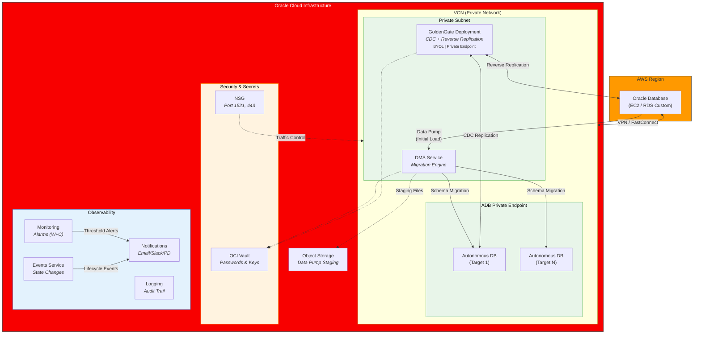
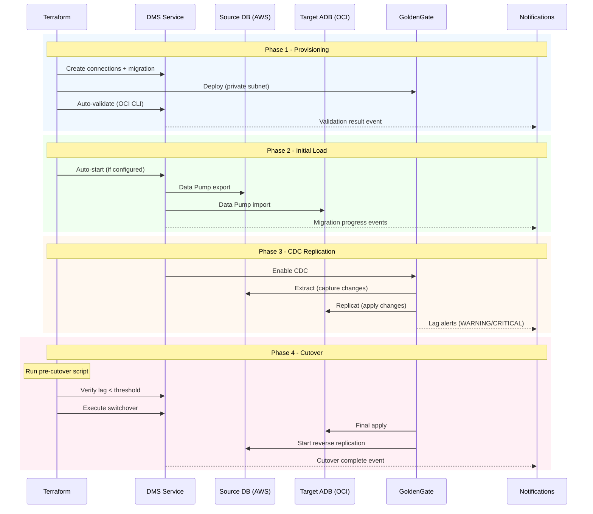
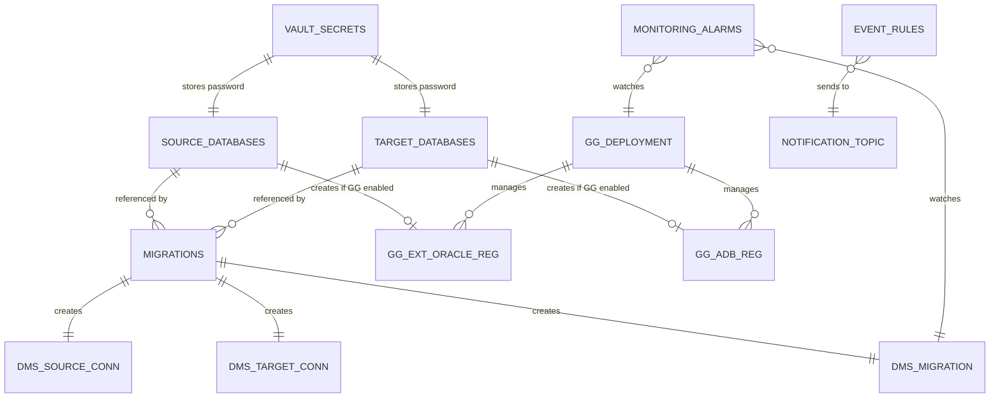

# Architecture

## High-Level Overview



## Data Flow



## Resource Mapping



## Network Topology

```
+------------------------------------------------------------------+
|  OCI VCN (10.0.0.0/16)                                          |
|                                                                  |
|  +---------------------------+   +---------------------------+   |
|  | Private Subnet            |   | Service Gateway           |   |
|  | 10.0.1.0/24               |   | (Oracle Services Network) |   |
|  |                           |   +---------------------------+   |
|  |  +--------+  +--------+  |                                   |
|  |  | DMS    |  | GG     |  |   +---------------------------+   |
|  |  | Conn   |  | Deploy |  |   | NAT Gateway               |   |
|  |  +--------+  +--------+  |   | (Outbound to AWS)          |   |
|  |                           |   +---------------------------+   |
|  |  +--------+  +--------+  |                                   |
|  |  | ADB PE |  | ADB PE |  |   +---------------------------+   |
|  |  | (Prod) |  | (N)    |  |   | DRG / VPN / FastConnect   |   |
|  |  +--------+  +--------+  |   | (AWS Connectivity)         |   |
|  |                           |   +---------------------------+   |
|  |  NSG: 1521, 443 ingress  |                                   |
|  +---------------------------+                                   |
|                                                                  |
+------------------------------------------------------------------+
             |                              |
             | VPN / FastConnect            | Internet (OCI Services)
             v                              v
     +--------------+              +------------------+
     | AWS VPC      |              | Object Storage   |
     | Oracle DB    |              | Vault, ONS, etc. |
     +--------------+              +------------------+
```
